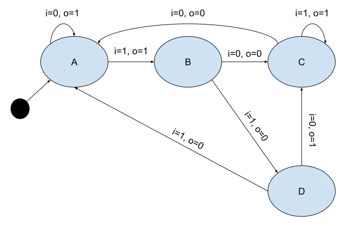

# Experiments re FSM encodings in SMT-LIB v2.6

## Example FSM

Th examples in this directory encode [the following FSM](https://docs.google.com/drawings/d/1QGgbEbWqsTUjZAK_6Z1cvZ7agTt5wBebzSxtO6gL6q0):

## Encodings

### Using Recursive Functions

Code: [recursion.smt2](recursion.smt2)

Notes:
- fsm-time-sort could be Int, but in this example I've used a simple enum type to keep the dependencies at a minimum.
- separate time and state sorts are only necessary so that the FSM can visit the same state twice. use one sort for both if you want to exclude any cyces in the state diagram.

### Using Assetions for state relationships

Code: [.smt2](recursion.smt2)

## References

- [SMT-LIB](http://smtlib.cs.uiowa.edu/)
- [SMT-LIB v2.6 Language](http://smtlib.cs.uiowa.edu/papers/smt-lib-reference-v2.6-r2021-05-12.pdf)
- [SMT-LIB v3 Language](http://smtlib.cs.uiowa.edu/version3.shtml)

